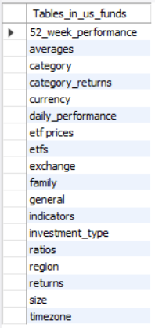
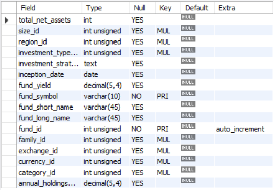

# Database Implementation

## Schema Implementation and .SQL File

The .sql file for the database and schema implementations can be found here: [SQL Implementation](Resources/US_Funds_DB_Implementation.sql)

The tables created with this command are shown below from the 'SHOW TABLES' command: (except the etfs and etf_prices tables, which were imported from the dataset).

The schema for 'general' using the 'DESCRIBE' command is shown here:

##
