# Database Implementation

## Schema Implementation and .SQL File

The .sql file for the database and schema implementations can be found here: [SQL Implementation](Resources/US_Funds_DB_Implementation.sql)

The tables created with this command are shown below from the `SHOW TABLES` command: (except the etfs and etf_prices tables, which were imported from the dataset).

## Schema Descriptions
### region
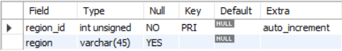
### currency
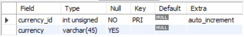
### family
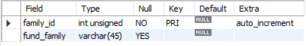
### category
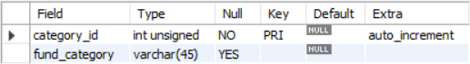
### timezone

### investment_type
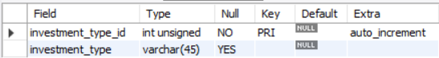
### size
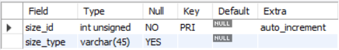
### exchange
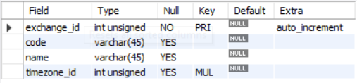
### general

### category_returns
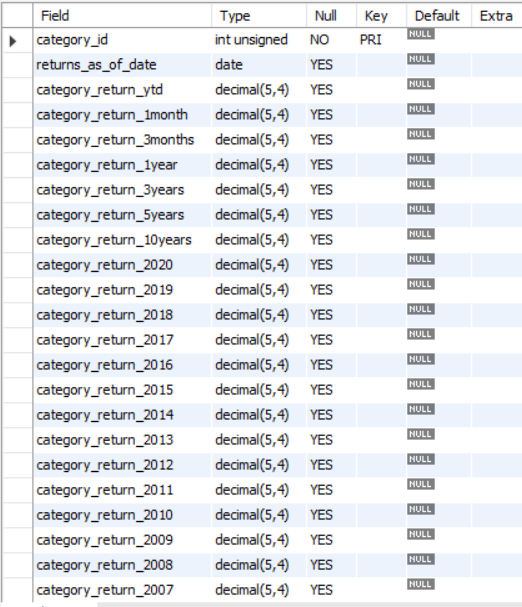
### daily_performance
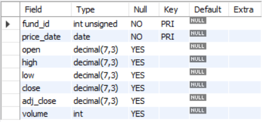
### indicators
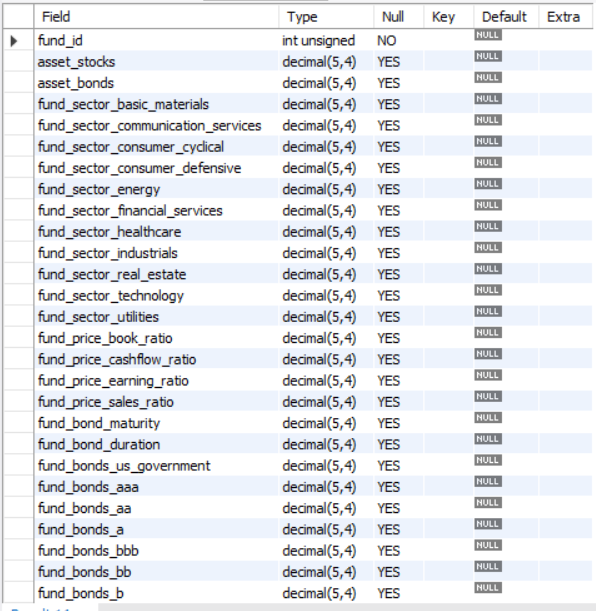
### returns

### ratios

### averages
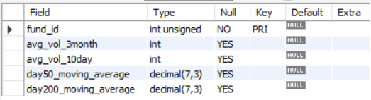
### 52_week_performance
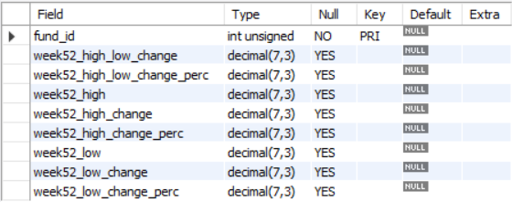

