## Schema Descriptions
### region

### currency
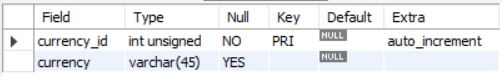
### family
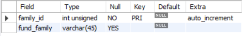
### category
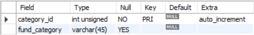
### timezone
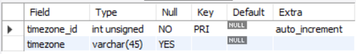
### investment_type
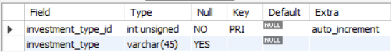
### size
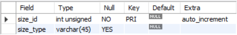
### exchange
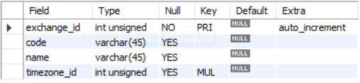
### general
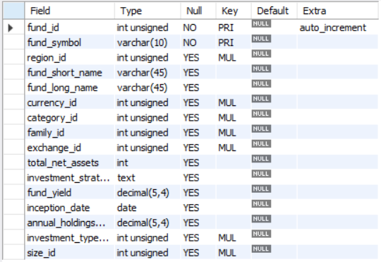
### category_returns
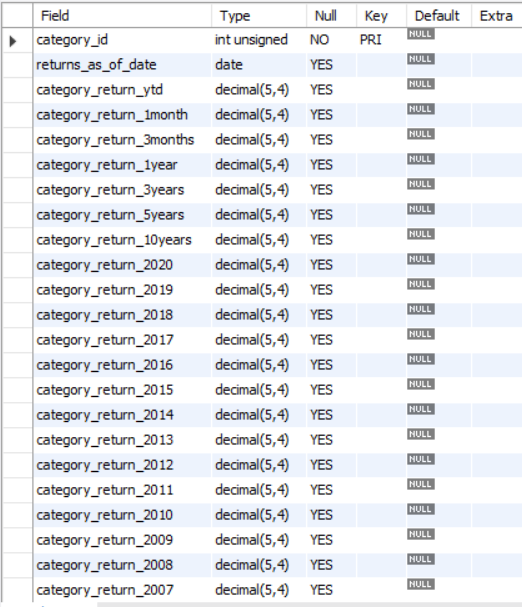
### daily_performance
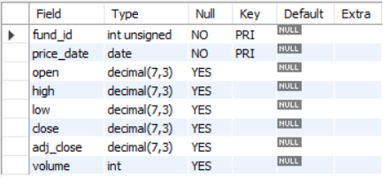
### indicators
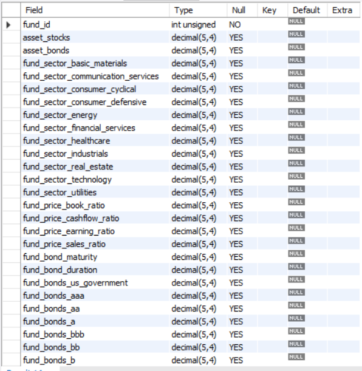
### returns
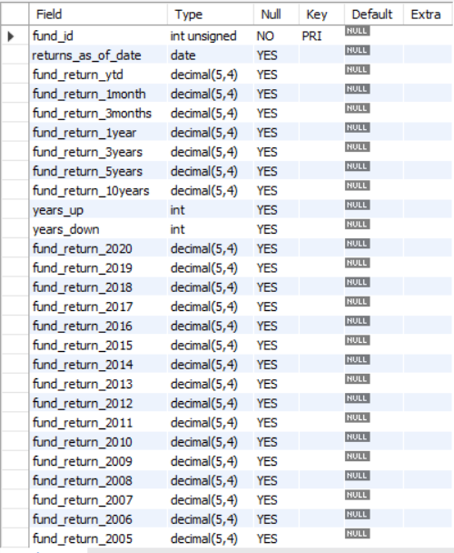
### ratios
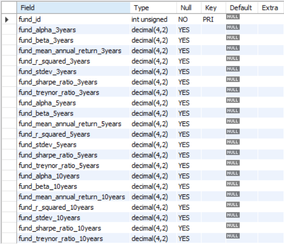
### averages
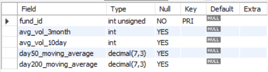
### 52_week_performance
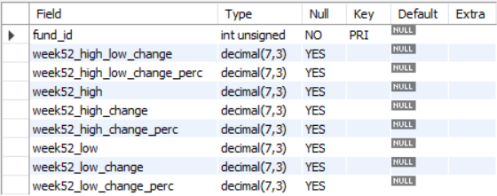
